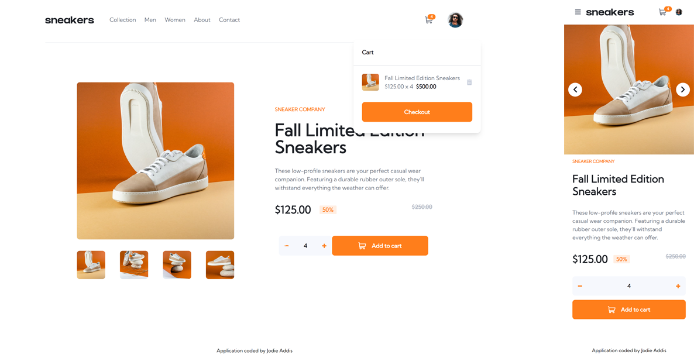

# E-commerce Snearkers

## About the project

E-commerce website offering the sale of sneakers. Products are presented with photos, a description, and their price. Users can choose the desired quantity of items and see the total price in the cart.
Photos can be viewed via a carousel by clicking on the main photo. The carousel is present by default on the mobile version.

<!-- All stories are hosted on Chromatic at this [URL](coming soon) -->

## Objectives

- [x] Open a lightbox gallery by clicking on the large product image
- [x] Switch the large product image by clicking on the small thumbnail images
- [x] Add items to the cart
- [x] View the cart with items
- [x] Remove items from the cart
- [x] View the optimal layout for the site depending on their device's screen size
- [x] See hover states for all interactive elements on the page

## Technologies Used

## About The Author

- [LinkedIn](https://www.linkedin.com/in/jodieaddis/)
<!-- - [Portfolio]() -->
